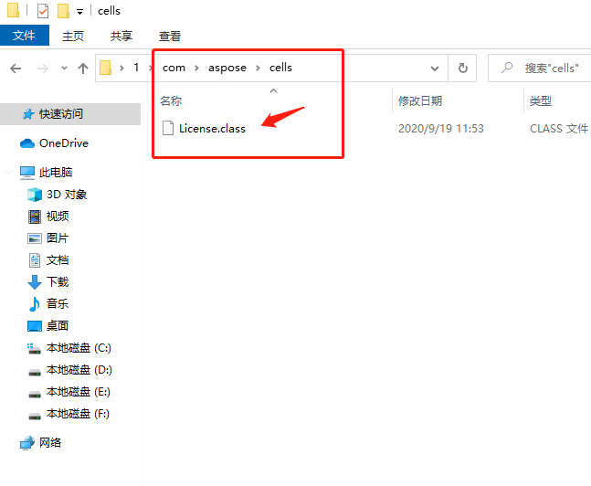
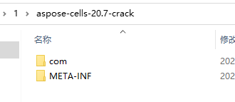
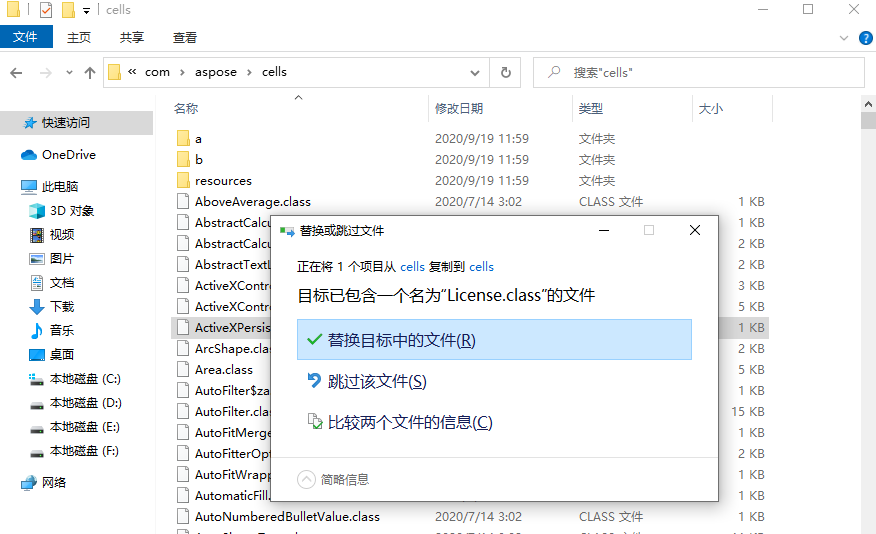
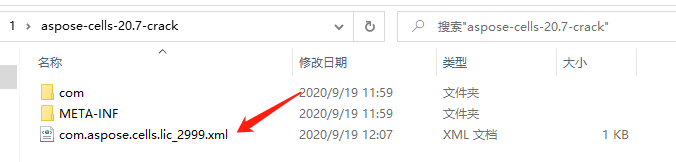
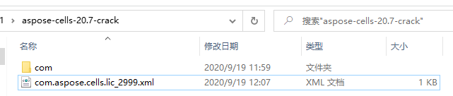
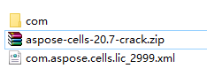
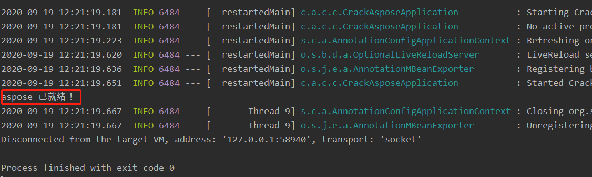
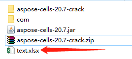
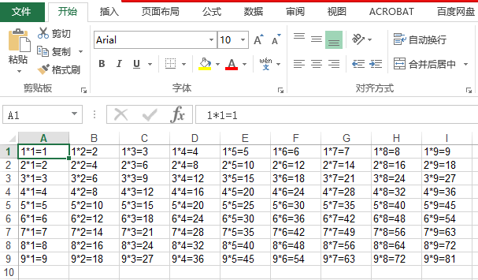

# aspose-cells-20.7.jar 破解

## 仅供学习，不可用于商业用途

###  一：源代码分析

使用 jd-gui.exe 反编译查看，直接搜索 License

分析代码，有三处代码需要修改

1.修改：

```java
  public static boolean isLicenseSet()
  {
    return a != null;
  }
```

为：

```java
  public static boolean isLicenseSet()
  {
    return true;
  }
```

 

2.修改：

```java
public void setLicense(InputStream stream)
  {
    Document localDocument = null;
    if (stream != null) {
      try
      {
        DocumentBuilder localDocumentBuilder = zad.b();
        localDocument = localDocumentBuilder.parse(stream);
      }
      catch (Exception localException1)
      {
        throw new CellsException(9, zf.a(new byte[] { -20, 93, -23, 54, -20, -49, -59, 86, -9, -86, 49, 44, -59, 71, -52, -86, -90, 6, -90, -25, -86, 1, -1, -92, -91, -126, 7, 113, -66, -95, -121, 16, -122, -126, 7, 104, -40, -70, -10, -37, 126, 7, -111, -121, -121 }) + localException1.getMessage());
      }
    }
    a(localDocument);
  }
```

为：

```java
  public void setLicense(InputStream paramInputStream)
  {
    a = new License();
    zbiw.a();
  }
```


3.修改：

```java
 private static Date k(String paramString)
  {
    if ((paramString == null) || (paramString.length() < 8)) {
      return null;
    }
    SimpleDateFormat localSimpleDateFormat = new SimpleDateFormat(zf.a(new byte[] { 79, 89, 33, -52, 79, -121, -125, 33, 71, -126, 105, -121 }));
    try
    {
      return localSimpleDateFormat.parse(paramString);
    }
    catch (ParseException localParseException)
    {
      throw new IllegalArgumentException(zf.a(new byte[] { -21, -113, -77, 13, -115, 27, Byte.MIN_VALUE, 35, 103, -52, -20, -106, 71, 95, 31, -73, -76, -38, 13, 31, -91, -97, -102, 85, -68, -33, -19, -87, -127, -14, 78, -23, 6, -25, -94, 1, -97, -95, -57, -121 }));
    }
  }
```

为：

```java
  private static Date k(String paramString)
  {
    return new Date(Long.MAX_VALUE);
  }
```

###  二.破解，生成 aspose-cells-20.7-crack.jar

修改 class 这里使用 javassist：

新建一个 Spring boot 项目：

 pom 文件中引用 javassist

```xml
<!-- https://mvnrepository.com/artifact/org.javassist/javassist -->
<dependency>
    <groupId>org.javassist</groupId>
    <artifactId>javassist</artifactId>
    <version>3.27.0-GA</version>
</dependency>
```

启动类中创建一个静态方法 crackAspose

```java
public static void crackAspose(String JarPath) throws NotFoundException,CannotCompileException, IOException {
        // 这个是得到反编译的池
        ClassPool pool = ClassPool.getDefault();
 
        // 取得需要反编译的jar文件，设定路径
        pool.insertClassPath(JarPath);
 
        CtClass cc_License = pool.get("com.aspose.cells.License");
 
        CtMethod method_isLicenseSet = cc_License.getDeclaredMethod("isLicenseSet");
        method_isLicenseSet.setBody("return true;");
 
        CtClass cc_License2 = pool.get("com.aspose.cells.License");
        CtMethod method_setLicense = cc_License2.getDeclaredMethod("setLicense");
        method_setLicense.setBody("{    a = new com.aspose.cells.License();\n" +
                "    com.aspose.cells.zbiw.a();}");
 
        CtMethod method_k = cc_License.getDeclaredMethod("k");
        method_k.setBody("return new java.util.Date(Long.MAX_VALUE);");
 
 
        cc_License.writeFile("C:\\Users\\DYG\\Desktop\\1");
    }
```

在 main 方法中执行 crackAspose

```java
try{
    crackAspose("C:\\Users\\DYG\\Desktop\\1\\aspose-cells-20.7.jar");
    System.out.println("Success!");
}catch (Exception e){
    e.printStackTrace();
}
```

运行，在代码中指定的目录下生成一个 class 文件。



复制一个     aspose-cells-20.7.jar  改名为   aspose-cells-20.7-crack.zip 然后解压



把刚才生成的 License.class 文件 替换到解压的源代码中。



造一个 License xml 文件，这里文件名为      com.aspose.cells.lic_2999.xml, 位置直接放源代码解压的根目录：



文件内容为：

```xml
<License>
  <Data>
    <Products>
      <Product>Aspose.Cells for Java</Product>
    </Products>
    <EditionType>Enterprise</EditionType>
    <SubscriptionExpiry>29991231</SubscriptionExpiry>
    <LicenseExpiry>29991231</LicenseExpiry>
    <SerialNumber>evilrule</SerialNumber>
  </Data>
  <Signature>evilrule</Signature>
</License>
```

防止文件指纹校验，我们需要删除掉源代码解压包中的 META_INF 文件夹。

最后的根目录:



压缩源代码（注意要是 zip 格式）




然后重命名为：

aspose-cells-20.7-crack.jar

破解完成！


三.测试 aspose-cells-20.7-crack.jar 使用

封装一个 License 验证方法：

```java
public static boolean authrolizeLicense() {
    boolean result = false;
    try {
        InputStream is = com.aspose.cells.License.class.getResourceAsStream("/com.aspose.cells.lic_2999.xml");
        License asposeLicense = new License();
        asposeLicense.setLicense(is);
        is.close();
        result = true;
    } catch (Exception e) {
        e.printStackTrace();
    }
    return result;
}
```

修改 main 方法测试使用：

```java
public static void main(String[] args) {
    SpringApplication.run(CrackAsposeApplication.class, args);

    /*
    // 修改 License.class
    try{
        crackAspose("C:\\Users\\DYG\\Desktop\\1\\aspose-cells-20.7.jar");
        System.out.println("Success!");
    }catch (Exception e){
        e.printStackTrace();
    }
    */


    // 测试破解后的 aspose-cells-20.7-crack.jar
    boolean auth = authrolizeLicense();
    if (!auth) {
        System.out.println("aspose 许可无效！");
        return;
    }


    System.out.println("aspose 已就绪！");


    try{
        Workbook wb = new Workbook();
        Worksheet ws = wb.getWorksheets().get(0);
        for (int i = 0; i < 9; i++)
        {
            for (int j = 0; j < 9; j++)
            {
                ws.getCells().get(i,j).setValue((i + 1) + "*" + (j + 1) + "=" + (i + 1) * (j + 1));
            }
        }

        wb.save("C:\\Users\\DYG\\Desktop\\1\\text.xlsx");
    }
    catch (Exception e){
        e.printStackTrace();
    }
}
```

运行：



到输出目录下，可以看到 text.xlsx 文件已生成：



文件类容

